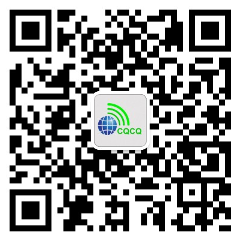

> 本文编辑：@BG5UWQ @BH3XZT @BH2VSQ @BH7GXU

# 组织或机构

## CRAC

微信号：deCRAC

认证主体：中国无线电协会

## 上海市业余无线电协会

微信号：weixin_sara73

认证主体：上海市业余无线电协会

  

## 三湘无线

名称：三湘无线

微信号：gh_02b53b8060d9

认证主体：湖南省工业和信息化厅(湖南省国防科技工业局)

  

# 个人爱好者

## 业余无线电

名称：业余无线电

微信号：ham_cn

认证主体：个人

  

## CQ业余无线电

名称：CQ业余无线电

微信号：CQYYWXD

认证主体：个人

  

## 业余无线电POTA

名称：业余无线电POTA

微信号：HAM-POTA-BY

认证主体：个人

  

## BH2VSQ

名称：BH2VSQ

微信号：BH2VSQ

认证主体：个人

  